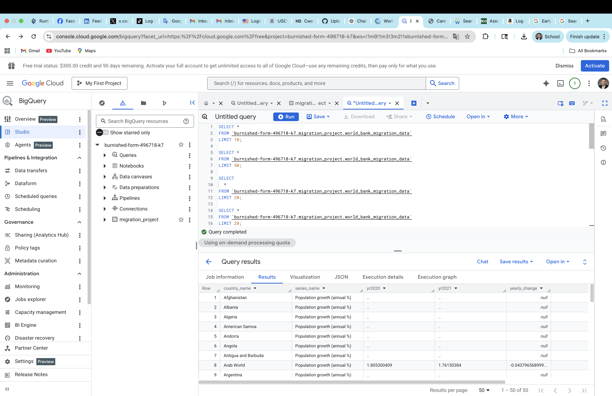

PROJECTS

BigQuery + Python Analysis of Migration, Demographics, and Economic Pressure | GitHub

● Built BigQuery analytical workflows using SQL window functions and World Bank datasets, performing cross-country economic trend analysis and cloud-based data transformation

● Applied SAFE_CAST, LAG(), and PARTITION BY functions to clean and analyze international development indicators within Google Cloud

● Developed GitHub-hosted analytics project integrating BigQuery, SQL, Python, and data visualization workflows for migration and demographic analysis

# BigQuery + Python Analysis of Migration, Demographics, and Economic Pressure

This project demonstrates cloud-based SQL analytics workflows using Google BigQuery, Python, and World Bank datasets to analyze migration, demographic, and economic indicators across countries.

## Tech Stack

- Google BigQuery
- SQL
- Python
- pandas
- matplotlib
- GitHub

## Workflow

BigQuery → SQL Analytics → Python Processing → Visualization → GitHub Documentation

## Key Features

- Built BigQuery analytical workflows using SQL window functions and World Bank datasets
- Applied SAFE_CAST, LAG(), and PARTITION BY functions for large-scale data transformation
- Developed Python analytics scripts using pandas and matplotlib for downstream analysis and visualization
- Structured cloud-based analytical pipelines for migration and economic trend analysis

## BigQuery SQL Workflow

## Query Results

